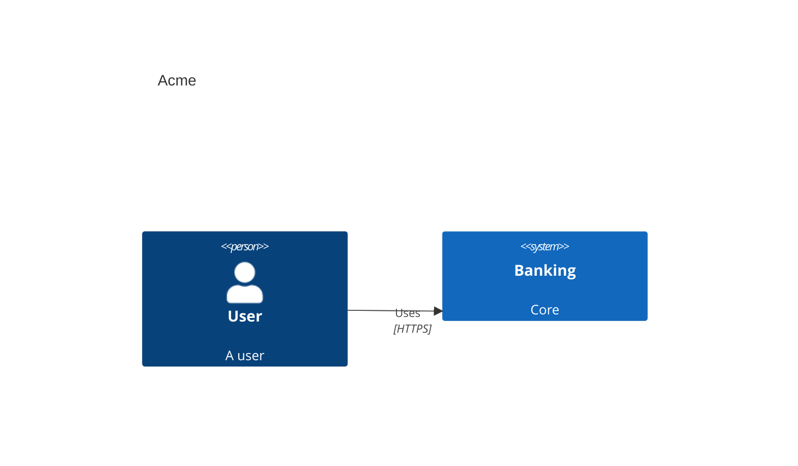

# mermaid-to-icepanel

CLI to convert Mermaid C4 diagrams into IcePanel `LandscapeImportData` YAML.

## Install

```bash
npm install
npm run build
```

## Usage

```bash
npx mermaid-to-icepanel input.mmd -o output.yaml
```

## Important constraint

IcePanel model import only imports model objects/connections. It does **not** create diagram canvases/layouts.

## Example

Input:



Output YAML contains `namespace`, `modelObjects`, and `modelConnections` suitable for IcePanel import.
